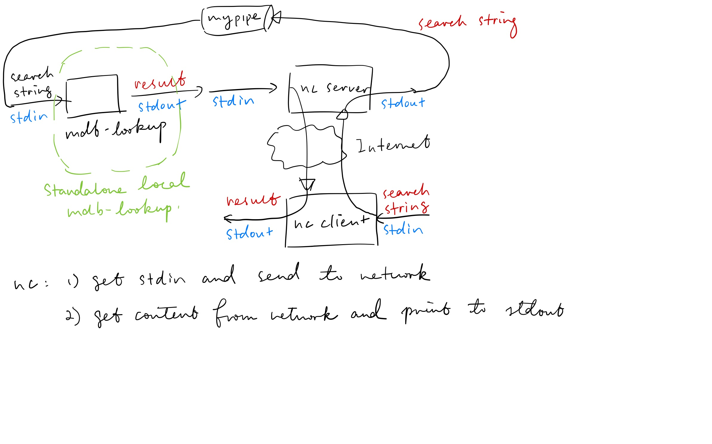

# 9/29

## Recordings

`09_17_2019` and `09_19_2019`

- Storage class - 02

  - automatic/local/stack variables

  - Static variables: the variable is kept at the start of the program

    - global: discouraged
    - file
    - block/function:  see example below

    Differences are just access

Function static variables:

```c
int f() {
  static int count = 0; // initialize in the first call only
  count++;
  return count;
}

int main() {
  int s = 0;
  for (int i = 0; i < 10; i++) {
    s += f();
  }
  printf("%d", s); // 55
}
```

- Address space - 02

  - Every process thinks it has the entire address space (often 512G)
  - Heap: allocate memory at runtime `malloc()`

  

- Pointers - 04
  - `int` and `int *` are incompatible types

    - cannot do `int *p = 1996`

  - `int *` and `double *` are incompatible types

    - but can force

    - ```c
      int i = 3;
      double d = 3.14;
      int *p = &i;
      double *q = &d;
      p = (int *)&d; // legal, but undefined behaviour
      ```

  - `void *`: not dereferencable


## Live

Review

Consider the code (suppose the address of `d` is 2000)

```c
int i = 1234;
double d = 3.14;
int *pi = &i;
double *pd = &d;
int x = *(int *)(pd);
```

| Expression   | Value                                            | Type       |
| ------------ | ------------------------------------------------ | ---------- |
| `pd`         | 2000                                             | `double *` |
| `(int *)pd`  | 2000                                             | `int *`    |
| `*(int *)pd` | `int` representation of the first 4 bytes of `d` | `int`      |


Recursion and stack

```c
int f(int x) {
  if (x <= 1) {
    return 1;
  } else {
    int y = x * f(x - 1);
    return y;
  }
}
```

When recursion goes deeper, stack goes down. When recursion returns, stack goes up. Print `x` and `&x` to see the change of stack.


# 10/1

`09_24_2019`

- `NULL` pointer - 04

  - In header files, `#define NULL ((void *) 0)`, so that `NULL + 1` is illegal

- Arrays - 05

  - `sizeof()` returns **byte** size

  - Theorem #1: `*(p + 1) == a[1]`
  - C allows a pointer to the next address to the last element of the array
  - Theorem #2: array name, in most cases, is the address of its first element: `a => &a[0]`
    - Exception 1: `sizeof(a)` is the byte size of the whole array
    - Exception 2: `a++` is illegal
  - Theorem #3 (generalize of the previous 2): `*(x + y) == x[y]`
  - `0[a] => *(0 + a) <=> *(a + 0) <=> a[0]`

- Heap - 05

  - Purpose: share address among functions


# 10/6

`09_26_2019`

- `char []` and string literals
  - `0` at the end is not fundamental. Instead it is a special case
  - `0` is just a marker that marks the end of a string
  - `char *p = "abc"`. Cannot change `p[0]` because it is stalled in static/code region
  - `printf("%s", "hello" + 1)` will print `ello` because the type of the second element is `char *`


- `strcpy`, `strcat`

  - Diagram at `38:00`. Pay attention to the stack pointer.

  - ```c
    void strcat(char *t, char *s) {
      while (*t) { t++; }
      strcpy(t, s);
    }
    ```

  - `strncpy` and `strncat` are the safer versions when `t` is shorter than `s`


- `argv`
  - stored right above the stack


# 10/8

- const

  - const can be get rid of

    ```c
    void foo(const char *t) {
      char *t2 = (char *)t; // then *t2 = 0 is legal
    }
    ```

- function pointer

  - ```c
    int (*f1)(const void *v1, const void *v2); // f1 is a variable, a pointer to a function returning int
    // can do f1 = *compareInt;
    int *f2(const void *v1, const void *v2); // function prototype, returns int *
    ```

  - Counter-clockwise spiraling (lecture `1:04:35`)

  - `compareInt` is the same as `&compareInt` as a syntax sugar because function name itself has no meaning


# Exam 1

- ` str[cpy, ncpy, cmp, ncmp]`

- lab 1 & 2 solutions


# 10/13

## `struct`

- `sizeof(struct)` may be bigger than sum of  `sizeof()`all its individual components

  ```c
  struct Pt { int x; double y; };
  struct Pt p1 = { 1, 2.2 };
  sizeof(p1) == 16; // on most Intel CPUs
  ```


## Linked List

- Should not use `assert()` in labs


# 10/22

- `fprintf(stdout)` is the same as `printf()`
- Opaque pointer: `FILE *` meant to be hold what is returned by functions such as `fopen()`, and be passed to other functions
  - Content pointed by opaque pointers are implementation-dependent: OS or standard libraries
- `stderr`, `stdout` and `stdin` are global variables of type `FILE *`. They represent standard [input, output, error]. When redirection is specified, they might come from actual files


# 10/27

Experiments:

- incompatible `sscanf()`: might be ok


# 11/5

## Reading/Writing Binary Files

- All files are just a sequence of bytes. But the bytes in text files are human readable
- Lines stored differently in Windows and Unix:
  - Unix: `'h','e', 'l', 'l', 'o', '\n'`
  - Windows: `'h','e', 'l', 'l', 'o', '\r', '\n'`
  - Translation of `fgets` and `fputs` is default. Suppress them using `rb` and `wb`
  - Use `b` for binary files and no `b` for text files to make your program portable


## Numeric IDs in UNIX

Show User ID and Group ID for files

```
ll -n
```

List PIDs

```
ps
```

Get the process tree

```
ps auf | grep UNI
```


## `fork()` and `exec()`

- `fork()` returns:
  - Parent: new PID of the **child**
  - Child: 0
  - Memorizing hint: `fork()` never returns the process's own PID

- `fork()` copies the whole process. Heap allocation must be freed in both parent and child processes.


# 11/10

## Recordings

- `netcat`

  - Run in server mode: `nc -l [port]`
  - client: `nc [ip] [port]`

- Turn `mdb-lookup` into server

  - Reading from **file** is different from reading from **pipe**
  - `mkfifo` creates a named pipe. Same functionality as `|` except it creates an entry in the directory
  - `./mdb-lookup < mypipe | netcat -l 10000 > mypipe`, or `cat mypipe | ./mdb-lookup | netcat -l 10000 > mypipe`

  


# 11/12

- socket API allows implementing similar functions like `netcat`, instead of using it

## Unix I/O

- `open()` is unix-based, as opposed to `fopen()`, which is part of C library and is cross platform


## Endian

- Intel CPU reverses byte order -- little endian
- Network order is big endian. `htonl()` converts the storing order to big endian, whatever the input is
  - host order: depends on the host
  - `ntohl()` does the reverse
  - Only matters if stored in raw integer. Today's system also uses `json` and `xml`


# 11/17

- Use of `sockaddr`: think of `sockaddr_in` as its sub-class
  - Inside connect, if `sin_family` is `AF_INET`, it will be casted back to `sockaddr_in`
  - `sockaddr` of IPV6 may expand beyond 16 bytes, so it is required to pass `sizeof(servaddr)` to `connect()`
- TCP does not preserve the boundary: need to receive multiple times
- `INADDR_ANY` is `0.0.0.0`: any network interface for the local server (IP address could different for WIFI/ethernet/USB interfaces)


# 11/24

- HTTP requests must ends with `\r\n`

HTTP request can be made from places other than the browser.

```
$ nc clac.cs.columbia.edu 80
GET / HTTP/1.0
```


# 12/1

Some useful commands

`rsync -avz tcp-recver.c UNI@clac.cs.columbia.edu:/path/to/folder/`

`dig address` (returns IP)